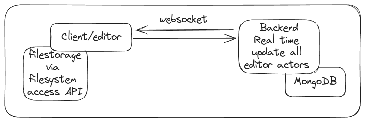
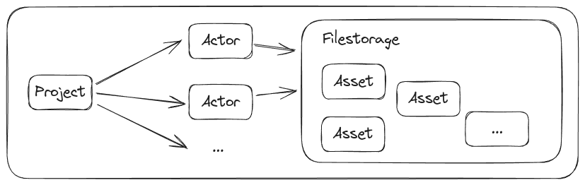

# 🚀 Remote 3D Editor

The Remote Editor allows users to collaboratively work on 3D scenes with a streamlined workflow. The main goal is to publish a 3D application under a specified link.



## High-Level Setup

Since files for 3D creations can be quite large, we use the **File Storage API** in Chrome to load necessary assets such as image textures, 3D models, and other resources.

To manage users and provide basic authentication/authorization, there’s an authentication system in place.

### Key Workflow Steps:
1. After login, users can create a project and invite collaborators.
2. When opening a project, users must provide the asset folder via the **File Storage API**.
3. This allows assets to be shared via cloud providers, eliminating the need to serve them through the web editor itself.
4. Once the assets are provided, they are verified. If all required files are present, the project can be edited within the 3D editor.

The backend maintains file paths to verify all assets for a project are loaded and tracks the relationships between them.



### Simplified Data Model Example:
```ts
enum ActorActions {
	add,
	delete,
	update,
}

interface Project {
	actors: Actor[];
	// Update actor via socket
	patchActor: (actor: Actor, actions: ActorActions) => void;
	...
	...
} 

interface Actor {
	label: string;
	syncState: {
		syncable: boolean;
		synced: boolean;
	};
	// Contains references to the Instances
	components: Map<string, THREE.Object | THREE.Material | ...>;
	...
	...
}

```

## Proof of Concept (POC) Feature Scope:

- ✅ Save, delete, and update actors
- ✅ WebSocket schema to update actors in real-time
- ✅ Basic authentication and authorization (authN/authZ)
- ✅ Rudimentary object editing in the frontend
- ✅ Functional connection to the File Storage API
- ✅ File upload for publishing a 3D application

### Stretch Goals 🎯:

- ⚡ Evaluate JavaScript files and attach them to actors
- ⚙️ Implement an ECS (Entity Component System)