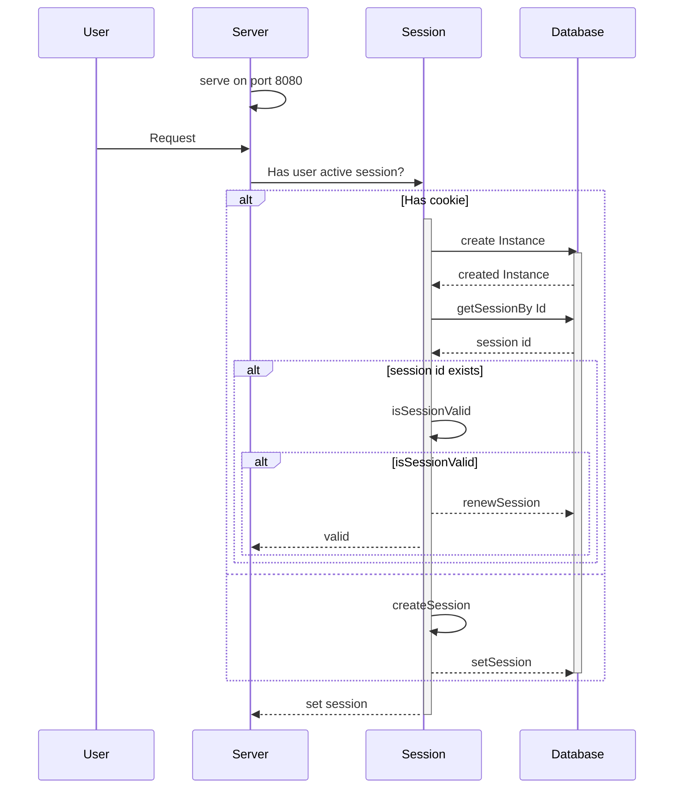

## WIP: BE Sequence Diagram

```mermaid
sequenceDiagram;
    participant User
    participant Server
    participant Session
    participant Database

    Server->>Server: serve on port 8080
    User->>Server: Request
    Server->>Session: Has user active session?
    activate Session

    alt Has cookie
        activate Session
        Session->>Database: create Instance
        activate Database
        Database-->>Session: created Instance
        Session->>Database: getSessionBy Id
        Database-->>Session: session id

        alt session id exists
            Session->>Session: isSessionValid

            alt isSessionValid
                Session-->>Database: renewSession
                Session-->> Server: valid
            end
        end

    else

            Session->>Session: createSession
            Session-->>Database: setSession
            deactivate Database

    end

    Session-->>Server: set session
    deactivate Session
```
